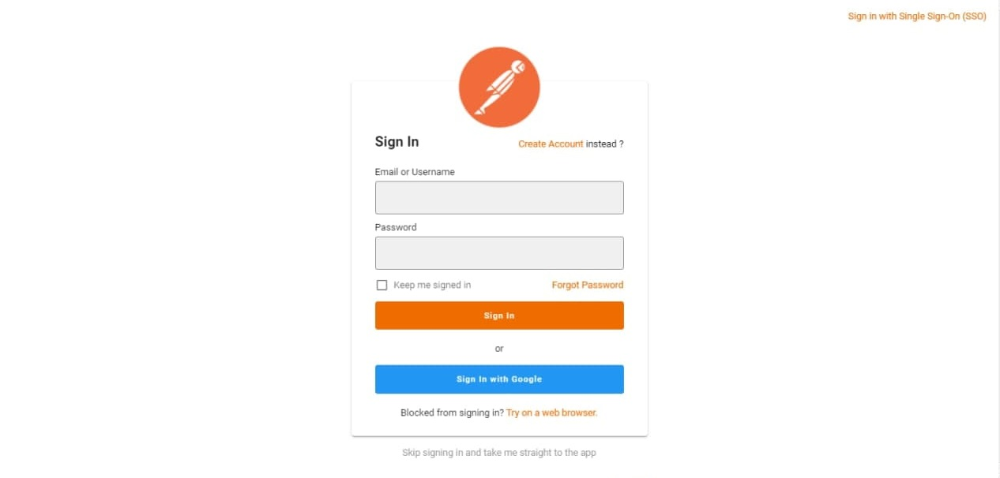

# Postman-UI-Clone


## Description:
This is Postman UI clone, made with [Vuetify](https://vuetifyjs.com/en/introduction/why-vuetify/), beside an authentication with both dark and light theme.

## What is Postman ?
Postman is a collaboration platform for API development. Postman's features simplify each step of building an API and streamline collaboration so you can create better APIs—faster.

## ScreenShots:




## Tools & languages:
* Vue.js (front end JavaScript framework)
* Vuetify (Material Design component framework)
* HTML
* CSS
* JavaScript
* Visual Studio Code ( Text editor )
* Paint.net (Image editor)


## Project setup
```
npm install
```

### Compiles and hot-reloads for development
```
npm run serve
```

### Compiles and minifies for production
```
npm run build
```

### Lints and fixes files
```
npm run lint
```

### Customize configuration
See [Configuration Reference](https://cli.vuejs.org/config/).

## Contribution:
Feel free to fork this project and add whatever you like. If you have any suggestions or any comments please feel free to contact me or to open an issue.

## Team:
[Jetlighters](https://github.com/JetLightStudio) having fun.

